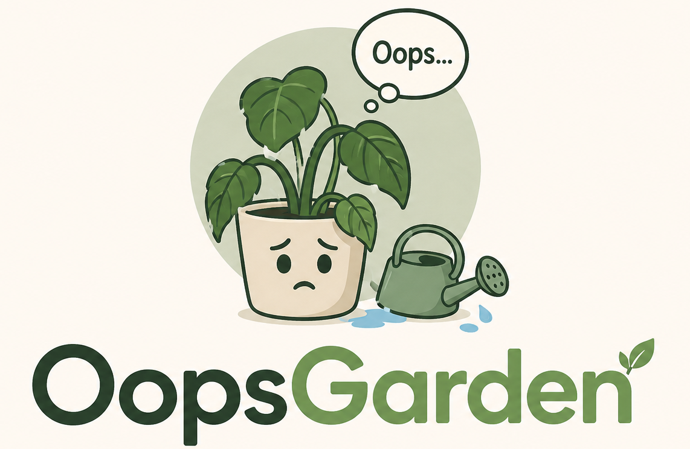

<p align="center">
  
</p>

# OopsGarden

ASP.NET Core + EF Core SQL Server MVP for tracking house plants, watering history, plant notes, photo history, locations, public gardens, and invite-based registration.

## Features

- Cookie authentication for users and administrators.
- Admin invite flow: create, list, revoke, and delete registration invites.
- User registration by invite, login, logout, and profile settings.
- Garden management: plants, locations, soil notes, planting dates, watering events, plant photos, and public garden visibility.
- Plant detail view with editable metadata, paged notes, watering calendar, and photo preview.
- Retrospective watering entry by selecting a date in the plant watering calendar.
- Plant history page that combines watering events, notes, automatic change notes, and photo history.
- Planting date consistency warning when history contains waterings or note events earlier than the planting date.
- Photo history for plant avatar updates, with dated previews and deletion of old or incorrect photos. Deleting the current photo falls back to the previous photo, or to the default placeholder when no photos remain.
- Public garden page/API for users who expose their garden, including public plant notes and history.
- SQL Server persistence through EF Core repositories and migrations.
- XML documentation is enabled for public API members.
- Unit and integration tests are split by tested type, following `ClassName.Tests.cs` naming.

## Projects

| Project | Purpose |
| --- | --- |
| `src/OopsGarden` | ASP.NET Core app, endpoint mapping, startup composition, static frontend hosting. |
| `src/Abstractions` | Public application contracts, use case interfaces, repository interfaces. |
| `src/Models` | Domain entities and value objects. |
| `src/Storage` | EF Core `DbContext`, entities, repositories, migrations. |
| `src/Transport` | HTTP request/response contracts and mapping helpers. |
| `src/*.Tests` | Unit and integration tests for each layer. |

## Frontend

The UI is a static browser app served from `src/OopsGarden/wwwroot`.
It supports English and Russian resources, authenticated garden management, public garden browsing, plant history, and photo preview navigation.

Key frontend files:

- `src/OopsGarden/wwwroot/index.html` - main application shell.
- `src/OopsGarden/wwwroot/css/app.css` - application styling.
- `src/OopsGarden/wwwroot/js/app.js` - garden, auth, admin, and history UI flows.
- `src/OopsGarden/wwwroot/js/photo-preview.js` - plant photo preview carousel.
- `src/OopsGarden/wwwroot/resources/*.json` - localized UI strings.

## Run

The SQL Server connection string is intentionally not stored in `appsettings.json`.
Set it as an environment variable before running the app:

```powershell
$env:ConnectionStrings__OopsGarden = "<connection string>"
dotnet run --project src/OopsGarden/OopsGarden.csproj --urls http://localhost:5297
```

Admin accounts are configured in `src/OopsGarden/appsettings.json`.
Default MVP admin:

- user: `admin`
- password: `ChangeMe123!`

Open the app at `http://localhost:5297`.
The admin UI is served from `/admin`.

## API

Main endpoint groups:

- `POST /api/auth/login`
- `POST /api/auth/admin-login`
- `POST /api/auth/register`
- `POST /api/auth/settings`
- `POST /api/auth/logout`
- `GET /api/me`
- `GET /api/garden/summary`
- `GET /api/garden/plants`
- `POST /api/garden/plants`
- `PUT /api/garden/plants/{id}`
- `DELETE /api/garden/plants/{id}`
- `POST /api/garden/plants/{id}/water`
- `POST /api/garden/plants/{id}/waterings`
- `GET /api/garden/plants/{id}/notes`
- `POST /api/garden/plants/{id}/notes`
- `DELETE /api/garden/plants/{plantId}/notes/{noteId}`
- `PUT /api/garden/plants/{plantId}/notes/{noteId}/date`
- `GET /api/garden/plants/{id}/history`
- `DELETE /api/garden/plants/{plantId}/waterings/{wateringId}`
- `DELETE /api/garden/plants/{plantId}/photos/{photoId}`
- `GET /api/garden/locations`
- `POST /api/garden/locations`
- `PUT /api/garden/locations/{id}`
- `DELETE /api/garden/locations/{id}`
- `GET /api/public/gardens/{id}`
- `GET /api/public/gardens/{gardenId}/plants/{plantId}/notes`
- `GET /api/public/gardens/{gardenId}/plants/{plantId}/history`
- `GET /api/admin/invites`
- `POST /api/admin/invites`
- `POST /api/admin/invites/{id}/revoke`
- `DELETE /api/admin/invites/{id}`
- `GET /api/admin/users`
- `POST /api/admin/users/{id}/block`
- `DELETE /api/admin/users/{id}`

## EF

Restore local tools and apply migrations:

```powershell
dotnet tool restore
dotnet tool run dotnet-ef database update --project src/Storage/Storage.csproj --startup-project src/OopsGarden/OopsGarden.csproj
```

Create a new migration:

```powershell
dotnet tool run dotnet-ef migrations add <MigrationName> --project src/Storage/Storage.csproj --startup-project src/OopsGarden/OopsGarden.csproj
```

## Build And Test

Build the solution from the repository root:

```powershell
dotnet build src/OopsGarden.slnx
```

Run all tests:

```powershell
dotnet test src/OopsGarden.slnx
```

Run tests with coverage:

```powershell
dotnet test src/OopsGarden.slnx --collect:"XPlat Code Coverage" --results-directory TestResults
```
